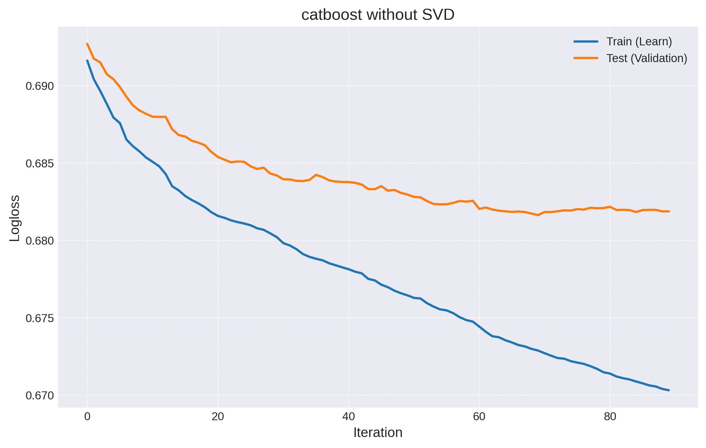
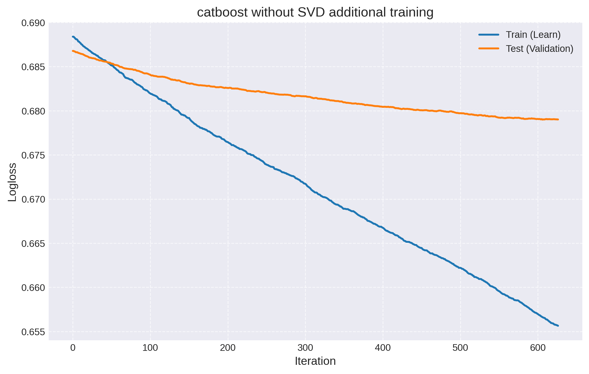

# oracle_predictions
## A model predicting victory in a Dota 2 eSports tournament based on hero selection and opposing teams.

**Language:** python

**ML Frameworks:** Catboost, Optuna

**Data**: SVD, PPMI (for hero embeddings)

For a quick start, you can build a Docker image to run the model—complete with a graphical interface—trained on the latest Dota 2 patch (example for Linux):
```
git clone https://github.com/VafelkaTSM/oracle_predictions.git && \
sudo docker build -t oracle_predictions . && \
sudo xhost +local:docker && \
sudo docker run -it --rm \
    -e DISPLAY=$DISPLAY \
    -v /tmp/.X11-unix:/tmp/.X11-unix \
    oracle_prediction
```
Hint: In the "Streak" field, enter the series of wins in matches over the last 10 days.

`parser_with_streak.py` is executed with two arguments: the first specifies the start date for retrieving matches, and the second specifies the end date. Dates must be provided in the YYYY-MM-DD format—for example: `python3.14 parser_with_streak.py 2026-03-26 2026-04-26`. Upon completion, the program saves a .pkl file containing the parsed professional match data to the execution directory.

`train_model_catboost_cpu_no_svd.py` and `train_model_catboost_cpu_svd_ppmi.py` train the model using parser output files. They are executed with two arguments: the first specifies the path to the file containing the core training data (e.g., matches from previous patches), while the second specifies the path to the file containing data for fine-tuning (representing the current meta). It is recommended to use files containing at least 4,000 matches each (approximately 1.5 months' worth of data). At the end of the process, the modules save the model and two files containing the encodings for the heroes and teams; these files are essential for operation `predict_model_catboost.py` and `model_gui.py`. The first module simply employs CatBoost, utilizing Optuna to tune the hyperparameters; the second module, in addition to this, first applies feature encoding using PPMI followed by SVD. The first option is recommended, as the second option does not yield a significant increase in accuracy yet is considerably more computationally demanding.

`predict_model_catboost.py` accepts a single argument: the path to the file used to fine-tune the model, which is then utilized to evaluate its accuracy фnd it must be launched in the same directory as the files being returned `train_model_catboost_cpu_no_svd.py` or `train_model_catboost_cpu_svd_ppmi.py`, фdditionally, the model is configured by default for the version *without* SVD; however, by setting the `coder_no_svd` to `coder_svd_ppmi` switch and specifying in `model.load_model` the filename containing the weights for the SVD-enabled model, you can calculate the accuracy for the SVD version. This evaluation is not subject to overfitting, as the model—during its training phase—segregates the specific subset of data used by this module for accuracy verification from both the training and validation sets. Alternatively, you may choose to train the model on the entire dataset and employ a separate, distinct set for accuracy verification by configuring variables: `separator`, `separator_1`, `separator_2` - within both modules. 

`predict_model_catboost.py` works using the files in the startup directory obtained as a result of work `train_model_catboost_cpu_no_svd.py` or `train_model_catboost_cpu_svd_ppmi.py`. By default, it works for the version without SWD, setting the `coder_no_svd` to `coder_svd_ppmi` switch and specifying in `model.load_model` the filename containing the weights for the SVD-enabled model, you can calculate the accuracy for the SVD version. In the "Streak" field, enter the series of wins in matches over the last 10 days.

The Dockerfile contains instructions for building a container with Module 1, based on a model trained without SVD on the latest Dota 2 patch.

The training process for both versions of the model on Patch 7.39, and fine-tuning for 7.40:



